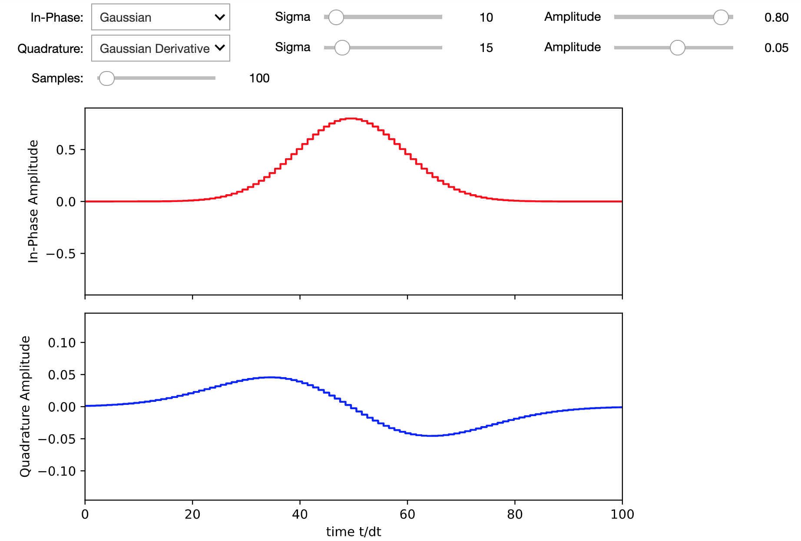
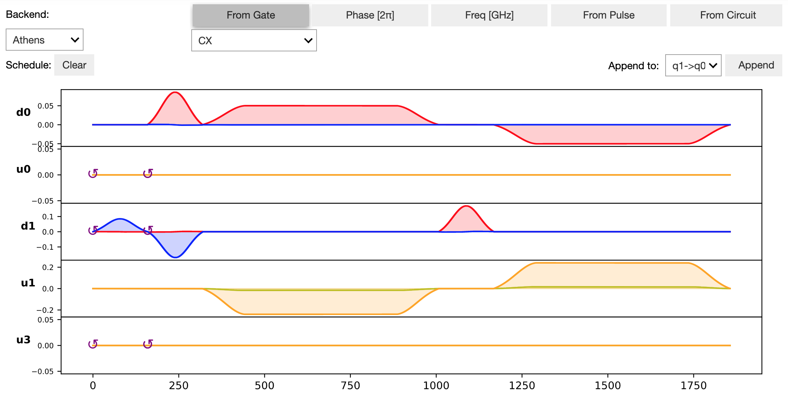

# Pulsemaker

Pulsemaker is a Python widget library for designing pulses and pulse schedules for quantum computing hardware. The library can be used in Jupyter notebooks, JupyterLab, and the IPython kernel.

Currently, the export feature only supports IBM's [Qiskit Pulse](https://qiskit.org/documentation/apidoc/pulse.html), but Rigetti's [Quil-T](https://pyquil-docs.rigetti.com/en/stable/quilt.html) will be supported in the future. Compatibility with other quantum hardware platforms, such as Pasqal's [Pulser](https://github.com/pasqal-io/Pulser) is also being considered.

To see a workflow that combines both the `PulseDesigner` and the `ScheduleDesigner` into a single dashboard, check out [qonduit](https://github.com/adgt/qonduit).

## Pulse Designer

## Schedule Designer


## Getting Started
### Installation

Installation currently requires a development installation (PyPI packages coming soon). Tested with JupyterLab 2, so may not work in JupyterLab 3 just yet.

For a development installation (requires npm),

    $ git clone https://github.com/adgt/pulsemaker.git
    $ cd pulsemaker
    $ pip install -e .

### Tutorials

For a tutorial on how to use the `PulseDesigner` take a look at [Tutorial_PulseDesigner.ipynb](https://nbviewer.jupyter.org/github/adgt/pulsemaker/blob/main/Tutorial_PulseDesigner.ipynb).

For a tutorial on how to use the `ScheduleDesigner` take a look at [Tutorial_ScheduleDesigner.ipynb](https://nbviewer.jupyter.org/github/adgt/pulsemaker/blob/main/Tutorial_ScheduleDesigner.ipynb)

Otherwise, you can simply run:
```
from pulsemaker import PulseDesigner, ScheduleDesigner
pulse_d = PulseDesigner()
schedule_d = ScheduleDesigner()
display(pulse_d)
display(schedule_d)
```

### API

PulseDesigner()
- `pulse`: waveform data for use in Qiskit

ScheduleDesigner()
- `pulses`: dictionary of pulses in the schedule
- `phases`: dictionary of phases in the schedule
- `freqs`: dictionary of frequencies in the schedule
- `schedule`: schedule in Qiskit format
- `circuit_qasm`: setter for converting qasm to a pulse schedule (write-only)

## Development

Follow the instructions above for a development installation. Then, to actively developing on your machine, run Jupyter Lab with the command:

    $ jupyter lab

Library files are located under the [pulsemaker](pulsemaker) folder. If you are doing work in JupyterLab or notebooks, then it is recommended to use the following for auto-reloading changes to the Python files:

```
%load_ext autoreload
%autoreload 2
```